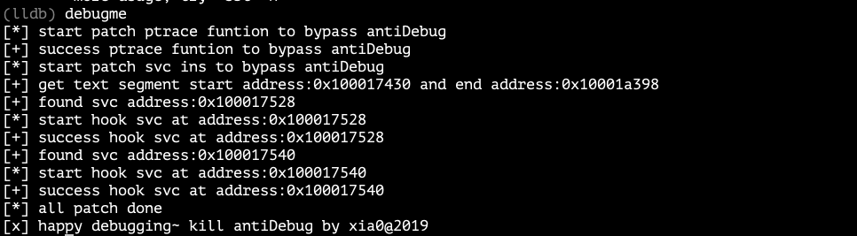

## xia0's lldb python script (Progressing)

### Install 

`git clone xia0LLDB_git_project `

`command script import git-xia0LLDB-path/xlldb.py` in lldb or `.lldbinit`

you can run `install.sh` auto add command script import git-xia0LLDB-path/xlldb.py to your `.lldbinit`

Happy debugging~~

### Commands

- `pcc`  is alias of  `process connect connect://127.0.0.1:1234 `
- `xbr   `  set breakpoint at OC class method although strip symbol like:`xbr "-[yourClass yourMethod]"`
- `sbt` the replacement of `bt` , it can restore frame OC symbol on stackframe. if you want to restore block symbol, you can use the ida python script provided to get block symbol json file. then input `sbt -f  block_json_file_path`  in lldb. Beside it can show more infomation: mem address, file address
- `xutil` this command has some useful tools(maybe fixable)
- `info` very useful command to get info of address/function/module and so on
- `ivars`  print all ivars of OC object (iOS Only)
- `methods`print all methods of OC object (iOS Only)
- `choose` get instance object of given class name, a lldb version of cycript's choose command

### TODO

- Anti-anti-debug：反反调试，即绕过应用的反调试机制 （已完成 2019/09/11）
- OCHOOK：在lldb中能够进行OC方法的HOOK等操作
- NetworkLog：监控lldb中能够监控网络数据
- UI Debug：一些UI相关的实用命令
- xbr增加对类所有方法下断点（已完成！2019/08/11）
- ...

### Update

- [2019/07/04] Update for **sbt -x / xutil**  :  xutil cmd and sbt -x to disable color output in Xcode
- [2019/07/21] Update for  **choose**  : lldb's choose command version of cycript's choose command
- [2019/08/07] Fix critical bugs in **choose**  : Fix critical bugs
- [2019/08/11] Update for **xbr** : `xbr className` can set breakpoint at adresses of all methods of class
- [2019/08/13] New **debugme**: kill anti debug in lldb
- [2019/08/20] New **info**:  get info of address/function/module and so on
- [2019/09/11] **debugme** update: hook ptrace and inlinehook svc ins done.


#### Update for sbt -x 2019/07/04

disable color output for Xcode terminal not support color output.

由于Xcode的终端不支持颜色输出，所以sbt命令增加了-x选项，设置以后会禁用颜色输出。

**sbt**

```
Usage: sbt -f block-json-file-path

Options:
  -h, --help            show this help message and exit
  -f FILE, --file=FILE  special the block json file
  -x, --XcodeNoColor    disable color output for Xcode
  -r, --reset           reset block file to None
```

**xutil**

```
(lldb) xutil -h
Usage: xutil [options] args

Options:
  -h, --help            show this help message and exit
  -b MAINMODULEADDRESS, --breakpointAtMainModule=MAINMODULEADDRESS
                        set a breakpoint at main module of given address
  -s SILDEMODULE, --slide=SILDEMODULE
                        get slide of given module
  -l LOADMODULE, --load=LOADMODULE
                        load a macho file
```

- `xutil -b mainModuleAddress`: auto set breakpoint of address on main image (auto add the main image slide)

  ```
  (lldb) xutil -b 0x0000000100009b60
  Breakpoint 2: where = choose`-[ViewController onClick:] at ViewController.m:53, address = 0x000000010001db60
  ```

- `xutil -s moduleName`: get silde of given module name

  ```
  (lldb) xutil -s choose
  Module:/var/containers/Bundle/Application/2E718F3A-CCBF-4251-9BB6-BBF57267CABB/choose.app/choose
  Silde:0x14000
  ```

- `xutil -l machoFilePath`: load the macho file like dylib in the process

  ```
  (lldb) xutil -l /Library/MobileSubstrate/DynamicLibraries/test.dylib
  Success
  ```

  

#### Update for choose 2019/07/21

##### choose

lldb's choose command version of cycript's choose command, test on iPhone6P in iOS10. **enjoy~**

从cycript移植到lldb的choose命令，在iOS10 iPhone6p测试通过。 **enjoy~**

```
(lldb) choose
[usage] choose className

(lldb) choose AppDelegate
<__NSArrayM 0x170054370>(
<AppDelegate: 0x17403e840>
)

(lldb) choose ViewController
<__NSArrayM 0x174054a90>(
<ViewController: 0x109e10550>
)
```

一些解释：

关于那两个计算公式的解释：iOS的malloc分配内存的时候会有tiny和small两种region。其中tiny以16B为quantum，small以512B为quantum。并且tiny在32位、64位机器上size分别为496B和1008B。所以，needed <= boundary是在检查分配内存是否小于tiny的size。(needed + 15) / 16 * 16 != size)主要是检查分配大小needed是否为16的倍数。更多关于苹果堆设计可以看我分析的一遍文章：

[http://4ch12dy.site/2019/04/01/%E6%B7%B1%E5%85%A5%E7%90%86%E8%A7%A3macos-heap/%E6%B7%B1%E5%85%A5%E7%90%86%E8%A7%A3macos-heap/](http://4ch12dy.site/2019/04/01/深入理解macos-heap/深入理解macos-heap/)


~~Tips: It seemdifferent of heap layout by malloc in iOS12, So choose cmd maybe has some bugs~~

~~说明:iOS12可能是malloc的布局发生了一些变化，导致choose的时候可能出现bug，后面有时间在适配一下。~~

是我自己代码写得有问题导致得….其他设备或者系统如果有问题的话，欢迎issue 或pr


#### Fix critical bugs in choose 2019/08/07

fix need check and something error when choose NSString


#### Update for xbr 2019/08/11

`xbr className` can set breakpoint at adresses of all methods of given class name.

xbr命令增加一个功能，`xbr className`就能够自动对该类的所有方法下断点，获取其方法调用顺序。

```
(lldb) xbr UPLivePlayerVC
Breakpoint 1: where = TestPaly`-[UPLivePlayerVC progressSliderSeekTime:] at UPLivePlayerVC.m:205, address = 0x0000000102dc134c
Breakpoint 2: where = TestPaly`-[UPLivePlayerVC progressSliderTouchDown:] at UPLivePlayerVC.m:197, address = 0x0000000102dc1184
Breakpoint 3: where = TestPaly`-[UPLivePlayerVC progressSliderValueChanged:] at UPLivePlayerVC.m:201, address = 0x0000000102dc11ec
...
Breakpoint 45: where = TestPaly`-[UPLivePlayerVC setUrl:] at UPLivePlayerVC.h:13, address = 0x0000000102dc2990
Breakpoint 46: where = TestPaly`-[UPLivePlayerVC play] at UPLivePlayerVC.m:124, address = 0x0000000102dbfd84
Breakpoint 47: where = TestPaly`-[UPLivePlayerVC pause] at UPLivePlayerVC.m:132, address = 0x0000000102dbfe1c
Set 47 breakpoints of UPLivePlayerVC
```

这里可以看出，已经对`UPLivePlayerVC`类的47个方法下了断点。

usage is above. Enjoy~

#### New debugme 2019/08/13

Base single instruction patch to anti-anti-debug in lldb 

基于内存patch的单指令patch反反调试

```
(lldb) debugme
Kill antiDebug by xia0:
[*] target address: 6501024128 and offset: 384
[*] mmap new page: 4572217344 success! 
[+] vm_copy success!
[+] mach_vm_write success!
[*] set new page back to r-x success!
[*] vm_region_recurse_64 success!
[*] get page info success!
[+] remap success!
[*] clear cache success!
[+] all done! happy debug~
```

相关分析见：http://4ch12dy.site/2019/08/12/xia0lldb-anti-anti-debug/xia0lldb-anti-anti-debug/

##### fix iOS11/12 vm_remap bug 2019/09/04

This bug is about wrong memory page size. I use the 4K on 32bit device instead of 16K on 64bit device.

Fxxk it!!! confuse me long time!

##### inline hook svc done 2019/09/11

now debugme can hook ptrace and inlinehook svc to kill anti debug. it is so strong ever!!!

```
[*] start patch ptrace funtion to bypass antiDebug
[+] success ptrace funtion to bypass antiDebug
[*] start patch svc ins to bypass antiDebug
[+] get text segment start address:0x100017430 and end address:0x10001a398
[+] found svc address:0x100017528
[*] start hook svc at address:0x100017528
[+] success hook svc at address:0x100017528
[+] found svc address:0x100017540
[*] start hook svc at address:0x100017540
[+] success hook svc at address:0x100017540
[*] all patch done
[x] happy debugging~ kill antiDebug by xia0@2019
```

#### New info 2019/08/20

get info of address/function/module and so on

```
usage: info  [-m moduleName, -a address, -f funtionName, -u UserDefaults]
```


### Screenshot

**bt**


**sbt**


**sbt -f block_json_file**


**debugme**




### Document

- [关于项目的分析](http://4ch12dy.site/2018/10/03/xia0LLDB/xia0LLDB/)
- [此项目的Frida移植版本](http://4ch12dy.site/2019/07/02/xia0CallStackSymbols/xia0CallStackSymbols/)

### Credits

- [http://blog.imjun.net/posts/restore-symbol-of-iOS-app/](http://blog.imjun.net/posts/restore-symbol-of-iOS-app/) thanks to the ida_block_json.py script

- https://github.com/DerekSelander/LLDB Special thanks to DerekSelander's LLDB provide the code framework

- [https://lldb.llvm.org/tutorial.html](https://lldb.llvm.org/tutorial.html) 

- https://github.com/hankbao/Cycript/blob/bb99d698a27487af679f8c04c334d4ea840aea7a/ObjectiveC/Library.mm choose command in cycript

- https://opensource.apple.com/source/lldb/lldb-179.1/examples/darwin/heap_find/heap.py.auto.html

  Apple lldb opensource about heap

- [https://blog.0xbbc.com/2015/07/%e6%8a%bd%e7%a6%bbcycript%e7%9a%84choose%e5%8a%9f%e8%83%bd/](https://blog.0xbbc.com/2015/07/抽离cycript的choose功能/) 抽离Cycript的choose功能

