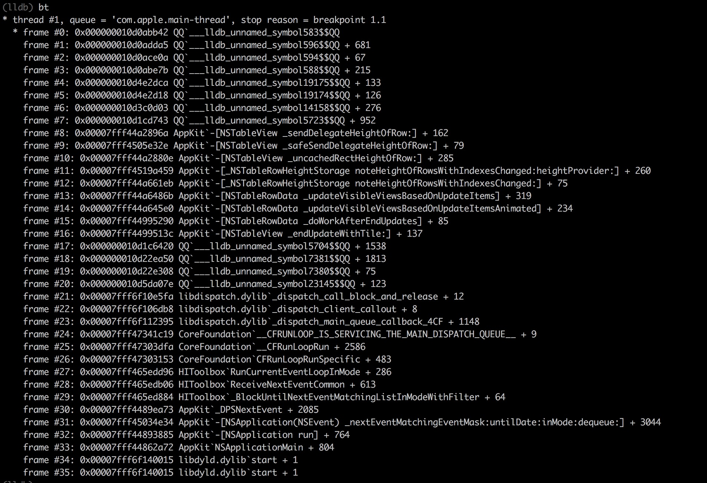
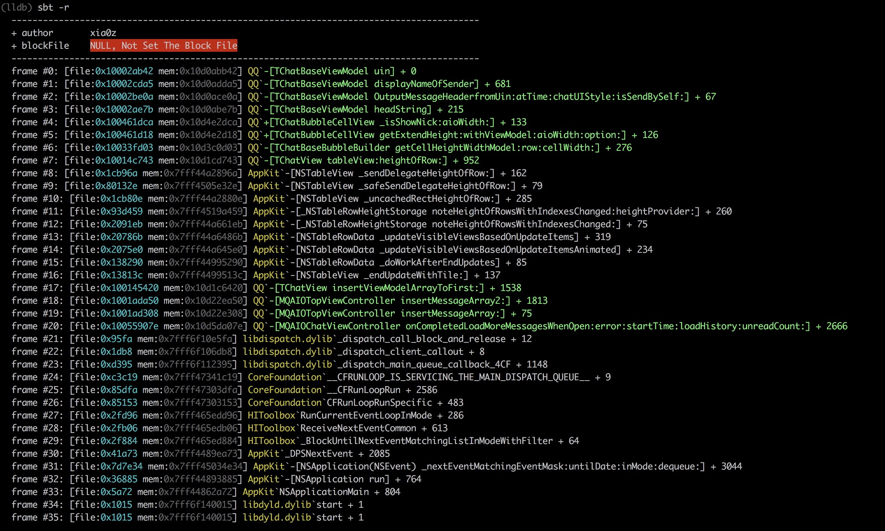
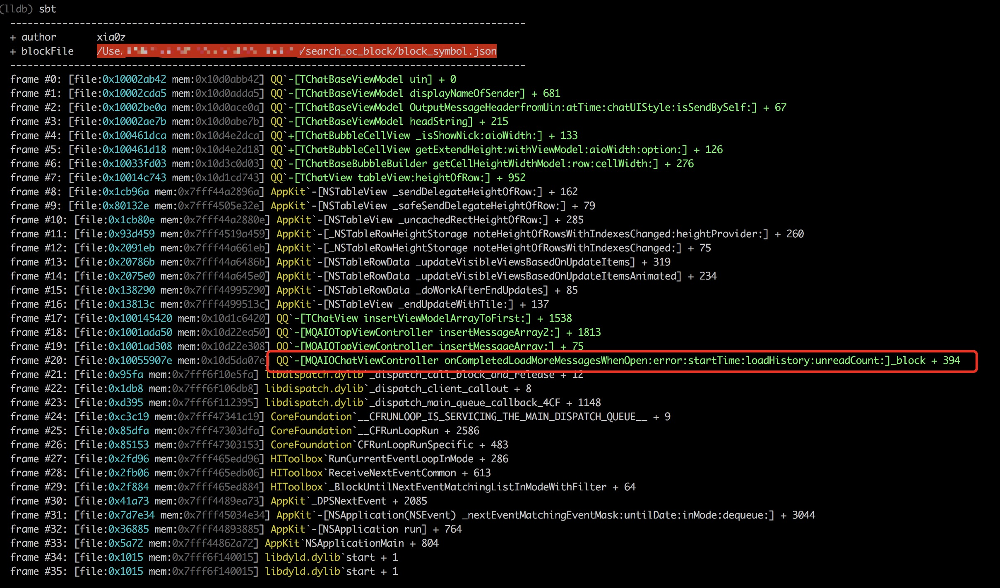

## xia0's lldb python script (Progressing)

### Install 

`git clone xia0LLDB_git_project `

`command script import git-xia0LLDB-path/xlldb.py` in lldb or `.lldbinit`


### Commands

- `pcc`  is alias of  `process connect connect://127.0.0.1:1234 `
- `xbr   `  set breakpoint at OC class method although strip symbol like:`xbr "-[yourClass yourMethod]"`
- `sbt` the replacement of `bt` , it can restore frame OC symbol on stackframe. if you want to restore block symbol, you can use the ida python script provided to get block symbol json file. then input `sbt -f  block_json_file_path`  in lldb. Beside it can show more infomation: mem address, file address

- `ivars`  print all ivars of OC object (iOS Only)
- `methods`print all methods of OC object (iOS Only)
- `choose` get instance object of given class name, a lldb version of cycript's choose command


### Update for sbt -x 2019/07/04

disable color output for Xcode terminal not support color output.

由于Xcode的终端不支持颜色输出，所以sbt命令增加了-x选项，设置以后会禁用颜色输出。

**sbt**

```
Usage: sbt -f block-json-file-path

Options:
  -h, --help            show this help message and exit
  -f FILE, --file=FILE  special the block json file
  -x, --XcodeNoColor    disable color output for Xcode
  -r, --reset           reset block file to None
```


### Update for choose 2019/07/21

#### choose

lldb choose command version of cycript's choose command, test on iPhone6P in iOS10. **enjoy~**

从cycript移植到lldb的choose命令，在iOS10 iPhone6p测试通过。 **enjoy~**

```
(lldb) choose
[usage] choose className

(lldb) choose AppDelegate
<__NSArrayM 0x170054370>(
<AppDelegate: 0x17403e840>
)

(lldb) choose ViewController
<__NSArrayM 0x174054a90>(
<ViewController: 0x109e10550>
)
```

**Tips: It seems different of heap layout by malloc in iOS12, So choose cmd maybe has some bugs  **

**说明:iOS12可能是malloc的布局发生了一些变化，导致choose的时候可能出现bug**

### Screenshot

**bt**



**sbt**



**sbt -f block_json_file**




### Document

- [关于项目的分析](http://4ch12dy.site/2018/10/03/xia0LLDB/xia0LLDB/)
- [此项目的Frida移植版本](http://4ch12dy.site/2019/07/02/xia0CallStackSymbols/xia0CallStackSymbols/)

### Credits

- [http://blog.imjun.net/posts/restore-symbol-of-iOS-app/](http://blog.imjun.net/posts/restore-symbol-of-iOS-app/)

- [https://lldb.llvm.org/tutorial.html](https://lldb.llvm.org/tutorial.html)

- https://github.com/hankbao/Cycript/blob/bb99d698a27487af679f8c04c334d4ea840aea7a/ObjectiveC/Library.mm choose command in cycript

- https://opensource.apple.com/source/lldb/lldb-179.1/examples/darwin/heap_find/heap.py.auto.html

  Apple lldb opensource about heap

- [https://blog.0xbbc.com/2015/07/%e6%8a%bd%e7%a6%bbcycript%e7%9a%84choose%e5%8a%9f%e8%83%bd/](https://blog.0xbbc.com/2015/07/抽离cycript的choose功能/) 抽离Cycript的choose功能

