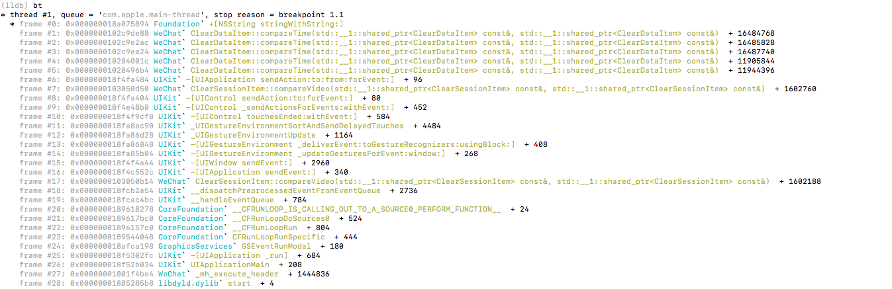
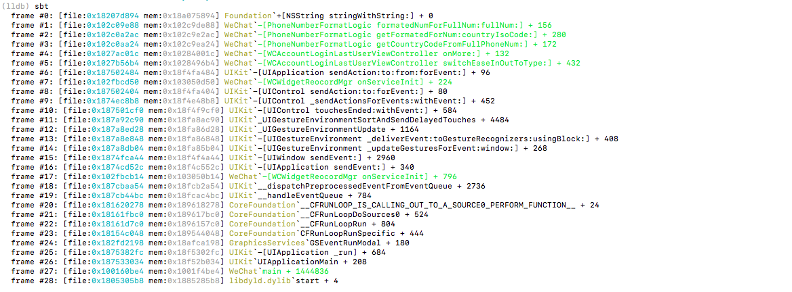

## xia0's lldb python script (Progressing)

### Install 

`git clone `项目以后，在`lldb`命令行中输入`command script import git-xia0LLDB-path/xlldb.py `即可导入安装

### Commands

- `pcc` 这个命令仅仅是 `process connect connect `的一个alias，后面输入目标ip和port连接到目标设备。例如：`pcc ://127.0.0.1:1234`

- `xbr`可以直接对OC函数下断点，即使macho符号表被strip。例如：`xbr "-[yourClass yourMethod]"`

- `sbt`代替系统的`bt`命令，专门为了strip后的栈符号恢复。仅仅输入`sbt`即可。如下效果：

  

  

  `sbt`命令可以提供更多的信息，内存地址在文件中的地址，不用手动计算直接在ida中查找即可。更强大的是可以恢复OC函数的符号，很清晰就能看到当前的调用栈情况。

### More

更多的方便lldb的命令还在开发中...